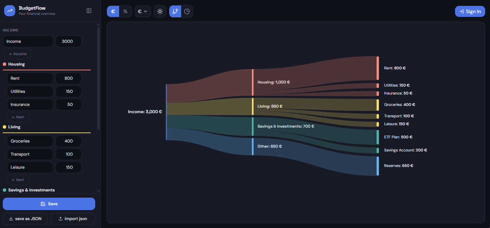

# BudgetFlow

<p align="center">
  
  
  
  
</p>

> A modern, self-hosted personal finance visualization application that helps you understand where your money goes through beautiful, intuitive charts.



---

## Features

### Interactive Charts
- **Sankey Flow** - Visualize money flow from income → categories → expenses
- **Donut Chart** - See proportional expense breakdown with category colors
- **Smart Alerts** - Warnings when expenses exceed income

### Smart Controls
- Multi-Currency support (€ $ £ CHF ¥ ₹ ₽ ₩)
- Live Updates - Edit in sidebar, see changes instantly
- Value/% Toggle - Switch between numbers and percentages
- Dark/Light Mode

### Data Management
- Local SQLite database (self-hosted)
- Optional authentication for multi-user access
- JSON Export/Import for backups

---

## Self-Hosting

### Quick Start with Docker

1. Create a `docker-compose.yml` file:
```yaml
services:
  budgetflow:
    image: ghcr.io/kinan/budgetflow:latest
    container_name: budgetflow
    ports:
      - "3000:3000"
    volumes:
      - budgetflow-data:/app/data
    environment:
      - JWT_SECRET=your-secure-random-string
      - AUTH_ENABLED=true
    restart: unless-stopped

volumes:
  budgetflow-data:
```

2. Start the container:
```bash
docker-compose up -d
```

3. Access the app at `http://localhost:3000`

### Configuration Options

| Variable | Default | Description |
|----------|---------|-------------|
| `PORT` | `3000` | Server port |
| `HOST` | `0.0.0.0` | Server host |
| `DATA_DIR` | `./data` | Path to store SQLite database |
| `JWT_SECRET` | - | **Required.** Secret key for JWT tokens |
| `JWT_EXPIRES_IN` | `7d` | Token expiration time |
| `AUTH_ENABLED` | `true` | Enable/disable authentication |
| `LOG_LEVEL` | `info` | Log level (debug, info, warn, error) |

### Build from Source

1. Clone the repository:
```bash
git clone https://github.com/kinan/budgetflow.git
cd budgetflow
```

2. Build the Docker image:
```bash
docker build -t budgetflow .
```

3. Run with environment variables:
```bash
docker run -d \
  --name budgetflow \
  -p 3000:3000 \
  -v budgetflow-data:/app/data \
  -e JWT_SECRET=your-secret-key \
  -e AUTH_ENABLED=true \
  budgetflow
```

---

## Development

### Prerequisites
- Node.js 18+
- npm or bun

### Setup

```bash
# Install dependencies
npm install

# Copy environment file
cp .env.example .env
# Edit .env and set JWT_SECRET

# Run development server
npm run dev
```

### Tech Stack

| Technology | Purpose |
|------------|---------|
| React | UI framework |
| TypeScript | Type safety |
| Vite | Build tool & dev server |
| Tailwind CSS | Styling |
| shadcn/ui | UI components |
| Fastify | Backend API |
| SQLite | Database |
| Docker | Self-hosting |

---

## License

MIT License - Feel free to use, modify, and distribute.

---

Built with ❤️ by Kinan